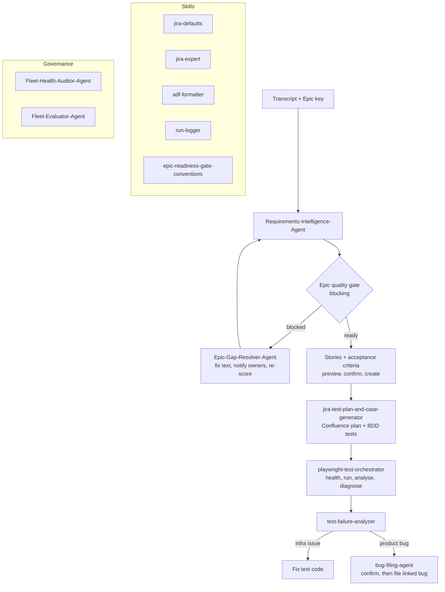

# Architecture

```mermaid
flowchart TD
    T[Transcript + Epic key] --> RIA[Requirements-Intelligence-Agent]
    RIA --> G{Epic quality gate<br/>blocking}
    G -- blocked --> GR[Epic-Gap-Resolver-Agent<br/>fix text, notify owners, re-score]
    GR --> RIA
    G -- ready --> S[Stories + acceptance criteria<br/>preview, confirm, create]
    S --> TP[jira-test-plan-and-case-generator<br/>Confluence plan + BDD tests]
    TP --> PO[playwright-test-orchestrator<br/>health, run, analyse, diagnose]
    PO --> TFA[test-failure-analyzer]
    TFA -- infra issue --> FIX[Fix test code]
    TFA -- product bug --> BF[bug-filing-agent<br/>confirm, then file linked bug]
    subgraph Skills
      JD[jira-defaults]
      JE[jira-expert]
      ADF[adf-formatter]
      RL[run-logger]
      CONV[epic-readiness-gate-conventions]
    end
    subgraph Governance
      FHA[Fleet-Health-Auditor-Agent]
      FEV[Fleet-Evaluator-Agent]
    end
```

Agents hold the workflow; skills hold shared facts and rules. Governance agents audit both.
